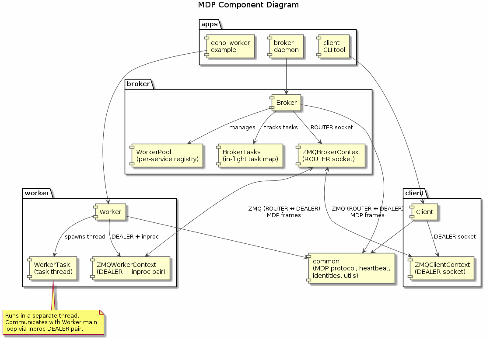
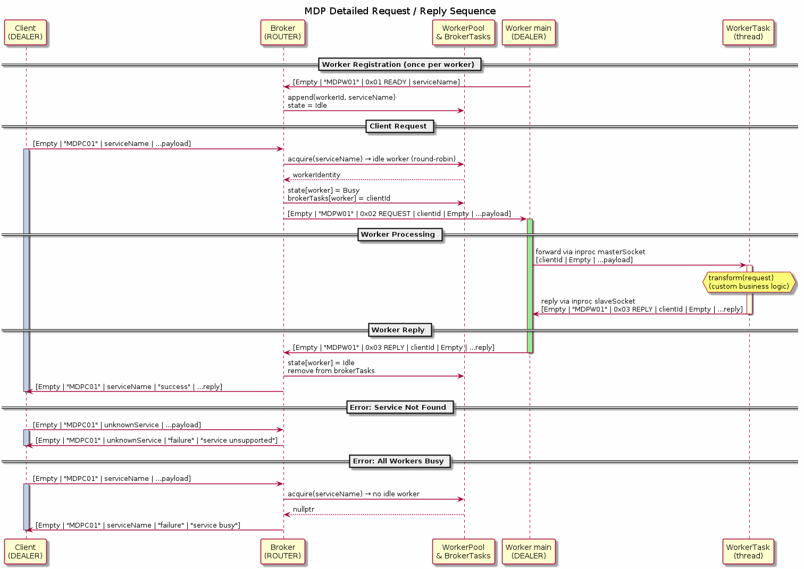
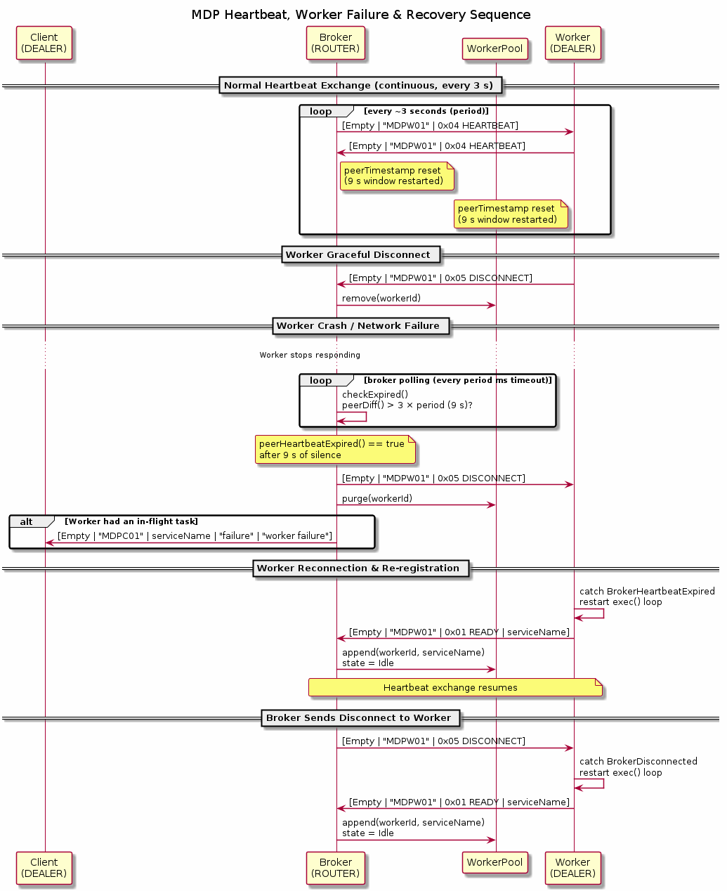

# Majordomo Protocol — Broker, Client and Worker

## Overview

Implementation of the
[Majordomo Protocol (MDP/RFC 7)](https://rfc.zeromq.org/spec:7/MDP) —
a reliable, service-oriented request-reply pattern built on
[ZeroMQ](http://zeromq.org).

The system provides a **message broker** that routes client requests to
registered workers by service name. Workers register themselves for named
services, process requests in a dedicated task thread, and return replies.
The broker enforces reliability through mutual heartbeating: dead workers
are detected and evicted within 9 seconds; clients receive an explicit
failure reply rather than hanging indefinitely.

Key characteristics:

- **Service discovery**: workers advertise named services at runtime;
  clients address services by name, not by worker address.
- **Load balancing**: idle workers for a service are selected round-robin.
- **Fault detection**: broker and workers exchange heartbeats every 3 s;
  absence for 9 s triggers disconnection and client notification.
- **Opaque payload**: message bodies are binary-safe — JSON, protobuf,
  or any other format can be used.
- **Horizontal scaling**: multiple workers may register for the same
  service; add workers without restarting broker or clients.

## Components

| Component | Role |
|-----------|------|
| **broker** | Central ROUTER; maintains worker registry, tracks
in-flight tasks, enforces heartbeating. |
| **worker** | DEALER; registers for a named service, processes requests
in a background task thread, returns replies. Reconnects on failure. |
| **client** | DEALER; sends a single blocking request and waits for
the reply. Stateless and ephemeral. |
| **common** | Shared protocol constants, message factories, heartbeat
monitor, identity helpers, and I/O utilities. |
| **apps/broker** | `broker` daemon — bind address set with `-a`. |
| **apps/client** | `client` CLI — reads JSON from file/stdin, prints
or saves JSON reply. |
| **apps/echo_worker** | Example `worker` that echoes input unchanged. |

## Diagrams

### Component



### Request / Reply Sequence



### Heartbeat and Failure Sequence



## Dependencies

Install system packages (Debian/Ubuntu):

```console
sudo apt-get install nlohmann-json3-dev libzmq3-dev
```

Third-party libraries used:

1. [ZeroMQ](http://zeromq.org)
2. [zmqpp — ZMQ C++ wrapper](https://github.com/zeromq/zmqpp)
   (included as a submodule)
3. [nlohmann/json](https://github.com/nlohmann/json)

## Building

Start by cloning the repository with all submodules:

```console
git clone --recurse-submodules https://github.com/wdl83/mdp
cd mdp
```

Then choose one of the build methods below.

### Make

```console
make install
```

Binaries and libraries are installed into `./install_dir/`.
Override with `make install INSTALL_DIR=/your/path`.

### CMake

```console
./build_rel.sh build_dir install_dir
```

Binaries and libraries are installed into `./install_dir/`.
For a debug build use `./build_dbg.sh` instead.

### Docker

Start a build container:

```console
cd docker
./make_env.sh
docker-compose up mdp --detach
docker exec -it mdp /bin/bash -l
```

Inside the container follow the Make or CMake instructions above.

## Usage

Install into `$HOME/.local` so binaries land on the default user `PATH`:

```console
# Make
make install INSTALL_DIR=$HOME/.local

# CMake
./build_rel.sh build_dir $HOME/.local
```

### Running the Broker

```console
broker -a tcp://0.0.0.0:6060
```

### Running as a systemd Service

Create `~/.config/systemd/user/broker.service`:

```ini
[Unit]
Description=MDP Broker

[Service]
Environment=TRACE_LEVEL=2
ExecStart=%h/.local/bin/broker -a tcp://0.0.0.0:6060
Restart=on-failure
RestartSec=10s

[Install]
WantedBy=default.target
```

Create `~/.config/systemd/user/echo-worker.service`:

```ini
[Unit]
Description=MDP Echo Worker
After=broker.service
Requires=broker.service

[Service]
Environment=TRACE_LEVEL=2
ExecStart=%h/.local/bin/worker -a tcp://localhost:6060 -s echo
Restart=on-failure
RestartSec=10s

[Install]
WantedBy=default.target
```

Enable and start both services:

```console
systemctl --user enable broker.service echo-worker.service
systemctl --user start broker.service echo-worker.service
```

To start user services at boot without login:

```console
loginctl enable-linger $USER
```

