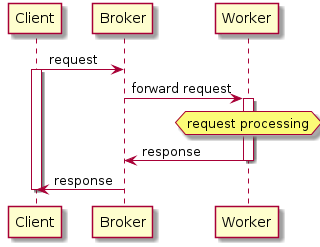
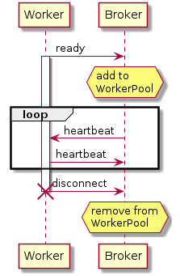

Majordomo Protocol Broker, Client and Worker
==============================================================

[Majordomo Protocol](https://rfc.zeromq.org/spec:7/MDP)

Dependencies
------------
1. [zmq library](http://zeromq.org)
1. [zmqpp: zmq library c++ wrapper](https://github.com/zeromq/zmqpp)
1. [json c++ library](https://github.com/nlohmann/json)

```console
# Debian based
sudo apt-get install nlohmann-json3-dev libzmq3-dev
```

Building with make
------------------

```console
git clone --recurse-submodules https://github.com/wdl83/mdp
cd mdp 
make install
```
Build artifacts will be placed in 'install_dir' dir.


Building with CMake
------------------

```console
git clone --recurse-submodules https://github.com/wdl83/mdp
cd mdp 
./buld_rel.sh build_dir install_dir
```
Build artifacts will be placed in 'install_dir' dir.


Docker build environment
------------------------

```console
git clone https://github.com/wdl83/mdp
cd mdp/docker
./make_env.sh # generate .env
docker-compose up mpd --detach
docker exec -it mdp /bin/bash -l
```

Follow build instruction listed above.

Usage
-----
Broker requires the IP address and listen port.
Running manually from console:

```console
broker -a tcp://0.0.0.0:6060
```

or better as systemd service.
Create .config/systemd/user/broker.service

```cosnole
# this config assumes you installed:
# broker in $HOME/bin
# libzmqpp.so* libraries in $HOME/lib
#
[Unit]
Description=MDP Broker

[Service]
Environment=TRACE_LEVEL=2
Environment=LD_LIBRARY_PATH=$HOME/lib/:$LD_LIBRARY_PATH
ExecStart=$HOME/bin/broker -a tcp://0.0.0.0:6060
Restart=on-failure
RestartSec=10s

[Install]
WantedBy=default.target
```

After systemd service file is created enable it:

```console
systemctl --user enable broker.service
```

and start

```console
systemctl --user start broker.service
```

Enable systemd to start $USER services at boot (no $USER login required)

```console
loginctl enable-linger $USER
```

## Simple Task Processing Flow



## Simple Worker Lifetime


